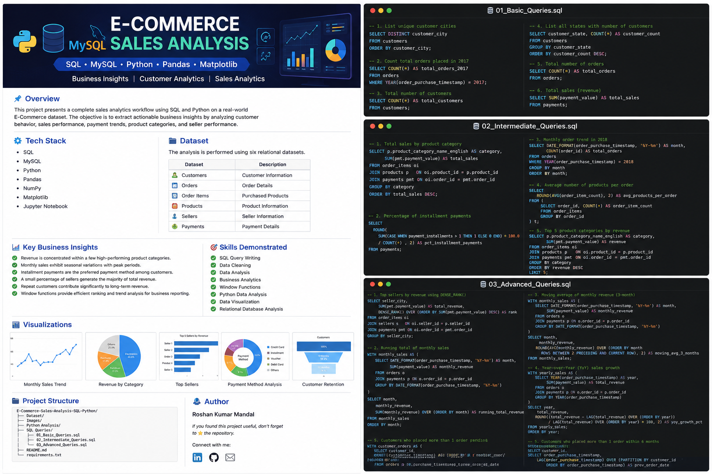
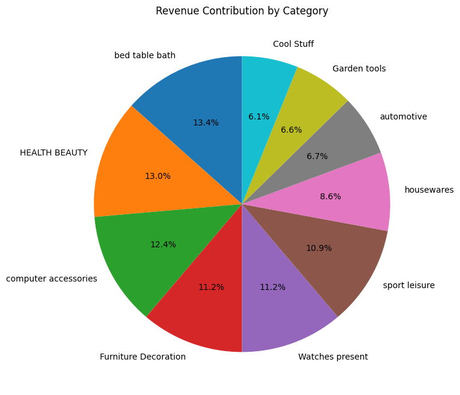

# 📊 E-Commerce Sales Analysis using SQL & Python



## 📌 Overview

This project presents a complete sales analytics workflow using SQL and Python on a real-world E-Commerce dataset. The objective is to extract actionable business insights by analyzing customer behavior, sales performance, payment trends, product categories, and seller performance.

The project demonstrates how SQL and Python complement each other in solving real business problems.

---

# 🚀 Tech Stack

- SQL
- MySQL
- Python
- Pandas
- NumPy
- Matplotlib
- Jupyter Notebook

---

# 📂 Dataset

The analysis is performed using six relational datasets:

| Dataset | Description |
|----------|-------------|
| Customers | Customer Information |
| Orders | Order Details |
| Order Items | Purchased Products |
| Products | Product Information |
| Sellers | Seller Information |
| Payments | Payment Details |

---

# 📈 Business Questions Solved

### Basic Analysis

- Unique customer cities
- Total orders in 2017
- Customer count by state
- Total sales

### Intermediate Analysis

- Revenue by category
- Monthly sales trend
- Average products per order
- Installment payment analysis

### Advanced Analysis

- Top Sellers using DENSE_RANK()
- Running Monthly Sales
- Moving Average
- Customer Retention
- Year-over-Year Growth
- Top Customers
- Revenue Contribution by Category

---

# 📊 Visualizations

## Monthly Sales Trend


---

## Revenue by Category



---

## Top Sellers


---

## Customer Retention


---

# 💡 Key Business Insights

- Revenue is concentrated within a few high-performing product categories.
- Monthly sales exhibit seasonal variations with peak periods.
- Installment payments are the preferred payment method among customers.
- A small percentage of sellers generate the majority of total revenue.
- Repeat customers contribute significantly to long-term revenue.
- Window functions provide efficient ranking and trend analysis for business reporting.

---

# 🧠 SQL Concepts Used

- INNER JOIN
- LEFT JOIN
- GROUP BY
- HAVING
- CASE
- Common Table Expressions (CTEs)
- Window Functions
- DENSE_RANK()
- Running Totals
- Moving Average
- Aggregate Functions
- Subqueries

---

# 📁 Project Structure

```
Dataset/
Images/
Python Analysis/
SQL Queries/
README.md
requirements.txt
```

---

# 🎯 Skills Demonstrated

✔ SQL Query Writing

✔ Data Cleaning

✔ Data Analysis

✔ Business Analytics

✔ Window Functions

✔ Python Data Analysis

✔ Data Visualization

✔ Relational Database Analysis

---

# 👨‍💻 Author

**Roshan Kumar Mandal**

If you found this project useful, don't forget to ⭐ the repository.
